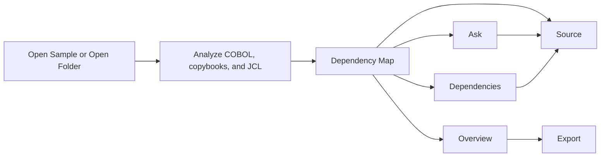
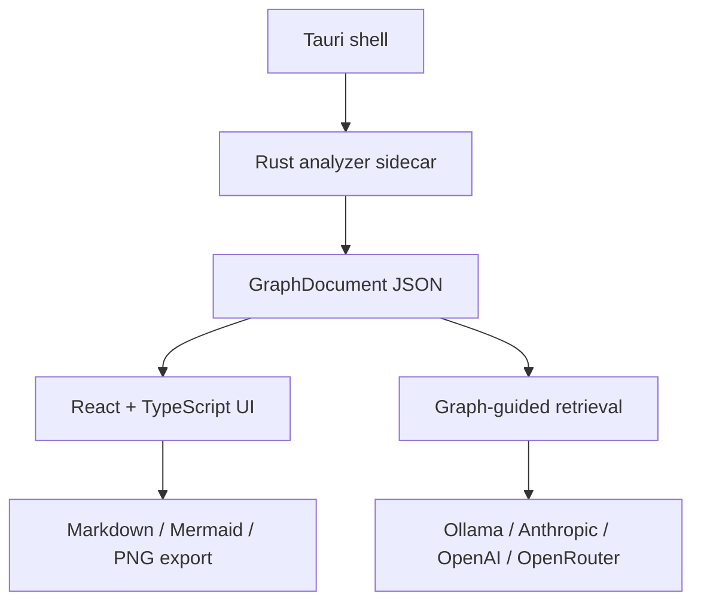

# Cobolens

Cobolens is a free, open-source, local-first desktop app for understanding COBOL, copybooks, and JCL. Point it at a codebase, inspect a focus-and-expand dependency map, jump into cited source, ask grounded questions, and export documentation without turning the project into a cloud migration exercise.

It is an understanding tool, not a translator, migration suite, or code generator.

## Why It Exists

COBOL systems often encode decades of business rules across programs, copybooks, JCL, datasets, CICS calls, and DB2 tables. The hard part is rarely one file. The hard part is answering:

- Where does this value come from?
- What writes this file?
- What depends on this copybook?
- Why are these two programs connected?
- Can I get a cited answer without sending the whole codebase to a vendor?

Cobolens is built for that first hour with an unfamiliar system.

## Current Status

As of 2026-07-01, Cobolens is a local v1 release candidate on the implemented M0-M6 scope.

| Area | Status |
| --- | --- |
| Desktop shell | Tauri v2 plus React/Vite is implemented. |
| Analyzer | Rust sidecar is the v1 production analyzer. ProLeap and mapa remain validated candidates, not production dependencies. |
| Graph UI | Focus-and-expand Sigma graph, source sync, filters, search, codebase browser, and visible node controls are implemented. |
| Source and citations | Source panel, citation jumps, relationship details, and focused source highlighting are implemented. |
| Ask | Graph-backed Ask works without AI. Broader AI Ask is opt-in and requires Settings setup. |
| Overview | Graph overview works without AI. AI summaries are guarded by citation checks and fall back to cited graph facts when needed. |
| Settings | One top-bar Settings drawer contains AI provider setup and scan settings. |
| Export | Markdown, Mermaid, and PNG documentation export is implemented. |
| Packaging | Linux packaging is locally validated. GitHub Actions builds unsigned Linux and Windows bundles for QA. Signed public installers are not claimed yet. |

## Product Tour

The app stays intentionally simple: one workspace, three panes, no project server.



### Top Bar

- Brand
- `Search codebase`
- Current focus, for example `LINEAGE - Program`
- Local/cloud indicator
- `Export`
- `Settings`

### Left Navigator

- Open the bundled sample or a local folder
- Browse grouped codebase units: programs, copybooks, JCL
- Filter node types and read the color legend
- Inspect inventory, parse health, and graph hints

The left rail is navigation and status only. AI and scan settings live in Settings.

### Center Graph

- Focus on one node at a time
- Expand direct neighbors instead of rendering a hairball
- Click nodes to change focus
- Click edge/source relationships to see why two things are connected
- Use the visible-node list for keyboard-friendly graph navigation

### Right Inspector

The inspector is organized around user tasks:

- `Overview`: graph facts, evidence, optional AI summary
- `Ask`: cited graph answers immediately, AI only after setup
- `Dependencies`: depends-on, used-by, lineage, and relationship details
- `Source`: file/line focus and source-viewer handoff

Graph answers work without AI. AI only runs when the user chooses an AI action.

## Quick Start

Install dependencies:

```sh
npm install
```

Run the desktop app in development:

```sh
npm run tauri dev
```

Run the browser demo graph:

```sh
npm run m6:fixture-graph
npm run dev -- --host 127.0.0.1 --port 1420
```

Then open:

```text
http://127.0.0.1:1420/?graph=/m6-bakeoff-graph.json
```

The browser demo can load generated graph/source JSON. Opening arbitrary local folders requires the desktop shell.

## Local AI Is Optional

Cobolens has two answer paths:

| Path | Requires AI? | What it does |
| --- | --- | --- |
| Graph Ask | No | Answers structural questions from the parsed dependency graph with citations. |
| AI Ask / AI Summary | Yes | Sends a retrieved, cited graph/source slice to the configured provider. |

Supported providers:

- Local Ollama
- Anthropic
- OpenAI
- OpenRouter

The default provider setting is Ollama, but Cobolens does not assume Ollama is installed or ready. Until AI is configured, AI actions open Settings or show `Set up AI first`.

Optional local Ollama setup:

```sh
ollama pull llama3.2
```

For smaller machines:

```sh
ollama pull llama3.2:1b
```

Check the local model path:

```sh
npm run ollama:check
npm run ollama:summary-smoke
npm run ollama:ask-smoke
```

## Build And Package On Linux

Install Tauri Linux prerequisites:

```sh
sudo apt-get update
sudo apt-get install -y \
  pkg-config \
  libdbus-1-dev \
  libwebkit2gtk-4.1-dev \
  libjavascriptcoregtk-4.1-dev \
  libsoup-3.0-dev \
  libgtk-3-dev \
  libayatana-appindicator3-dev \
  librsvg2-dev \
  patchelf
```

Check packaging readiness:

```sh
npm run m6:packaging-readiness
```

Build release bundles:

```sh
npm run tauri build
```

The release build runs:

```sh
npm run tauri:before-build
```

That compiles the frontend and the Rust analyzer sidecar, then packages app resources.

Expected Linux outputs:

- `src-tauri/target/release/bundle/deb/Cobolens_0.1.0_amd64.deb`
- `src-tauri/target/release/bundle/rpm/Cobolens-0.1.0-1.x86_64.rpm`
- `src-tauri/target/release/bundle/appimage/Cobolens_0.1.0_amd64.AppImage`

The packaged resource layout includes:

- `binaries/cobolens-analyze`
- `samples/mini-bank/`

On Windows, the analyzer sidecar resource is `binaries/cobolens-analyze.exe`.

## Verification

Run the main verification suite:

```sh
npm run m6:verify
```

Run the broader v1 readiness sweep:

```sh
npm run v1:readiness
```

Useful focused checks:

```sh
npm run build
npm run desktop:smoke
npm run desktop:packaged-smoke
npm run validate:benchmark:local
npm run m6:compare-candidates
```

`npm run m6:verify` covers:

- strict M6 fixture
- frontend build
- export docs smoke
- graph Ask smoke
- semantic retrieval smoke
- UI contract smoke
- accessibility smoke
- packaging contract smoke
- model privacy and embedding privacy smokes
- prompt and guard smokes
- Rust sidecar tests
- Tauri command tests
- parser candidate comparison
- parser upgrade readiness

## Architecture

Cobolens is deliberately small:



The key contract is `GraphDocument`: the UI, Ask, source citations, dependencies, and export all consume graph nodes and edges from that JSON contract. Parser internals stay behind the sidecar boundary.

Production analyzer decision:

- Use the Rust sidecar for v1.
- Keep ProLeap and mapa as benchmarked candidates.
- Do not adopt a JVM analyzer until real-code coverage justifies the packaging and maintenance cost.

## Repository Map

| Path | Purpose |
| --- | --- |
| `src/` | React/TypeScript app. |
| `src/graph/` | Sigma/graphology graph view. |
| `src/model/` | Provider config, prompts, summaries, embeddings, readiness. |
| `src/retrieval/` | Graph Ask and semantic retrieval. |
| `src-tauri/` | Tauri shell, commands, packaged resources. |
| `sidecar/cobolens-analyze/` | Rust production analyzer. |
| `sidecar/cobolens-analyze-jvm/` | ProLeap candidate analyzer. |
| `sidecar/cobolens-analyze-mapa/` | mapa candidate analyzer. |
| `fixtures/m6-bakeoff/` | Strict lineage/impact fixture. |
| `samples/mini-bank/` | Bundled sample codebase. |
| `tools/` | Verification, packaging, benchmark, local-model, and parser comparison scripts. |
| `docs/` | PRD, agent guide, audits, parser notes, readiness evidence. |

## Documentation Map

- [Current PRD](docs/COBOL-Lens-PRD.md)
- [Agent guide](docs/AGENTS.md)
- [V1 readiness audit](docs/v1-readiness-audit.md)
- [M6 completion audit](docs/m6-completion-audit.md)
- [M6 UI QA](docs/m6-ui-qa.md)
- [Parser upgrade readiness](docs/m6-parser-upgrade-readiness.md)

Historical research is kept in `docs/00-*` through `docs/05-*`.

## Roadmap

Highest-value next work:

1. Test against several real COBOL/JCL repositories and record parser gaps.
2. Improve source browsing: full-file mode, symbol clicks, jump-to-definition, references.
3. Make relationship explanations more obvious directly from the graph canvas.
4. Harden local AI setup: clearer Ollama missing/running/model-missing states.
5. Validate signed Windows packaging before public release claims.
6. Decide whether a JVM parser candidate is worth the extra packaging weight after real-code evidence.

Explicit non-goals for v1:

- COBOL generation or editing
- COBOL-to-Java translation
- behavior-equivalence verification
- live mainframe connectivity
- team/cloud sync
- a hosted backend

## License

MIT. See [LICENSE](LICENSE).
