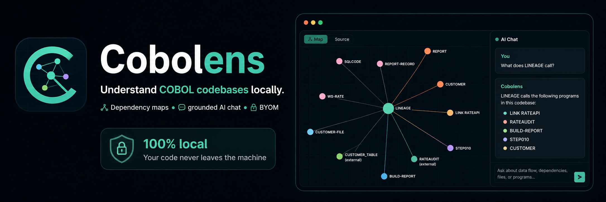
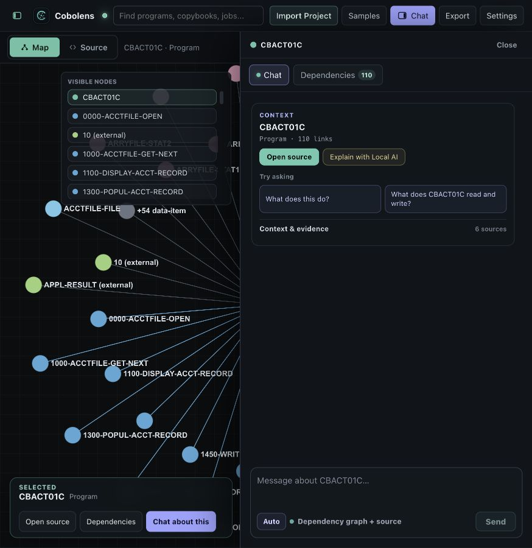
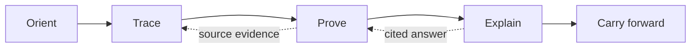
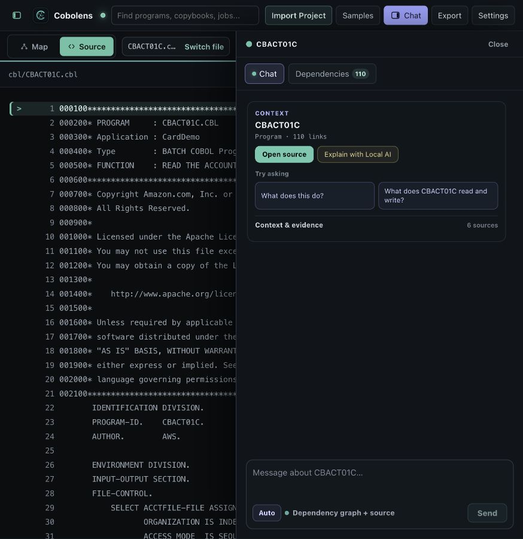
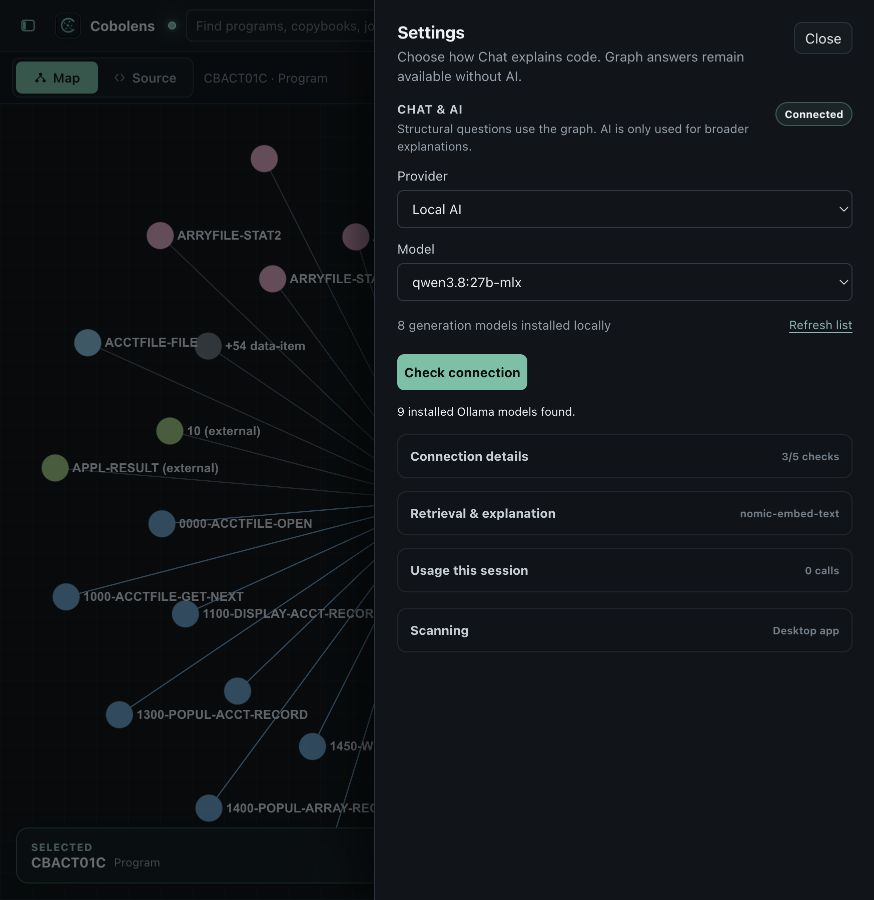
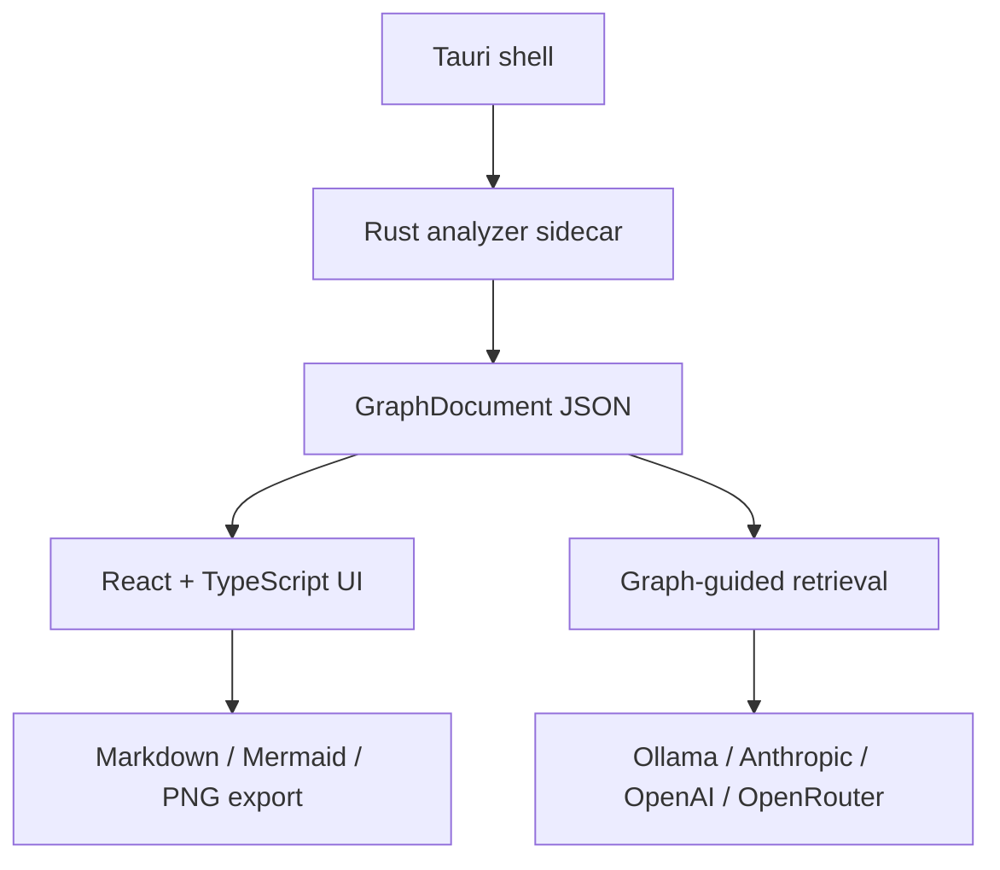

<div align="center">
  
  <h1>Cobolens</h1>
  <p><strong>Trace the system. Prove every answer.</strong></p>
  <p>A free, open-source, local-first investigation desk for COBOL, copybooks, and JCL.</p>
  <p><sub>No account · AI optional · Graph answers work offline · MIT licensed</sub></p>
  <p>
    <a href="https://github.com/chrissotraidis/cobolens/actions/workflows/health.yml"></a>
    <a href="https://github.com/chrissotraidis/cobolens/actions/workflows/package.yml"></a>
    <a href="LICENSE"></a>
    <a href="#local-ai-is-optional"></a>
  </p>
  <p>
    <a href="#quick-start">Quick start</a> ·
    <a href="#sample-library">Explore samples</a> ·
    <a href="#how-it-works">How it works</a> ·
    <a href="docs/PRODUCT-DESIGN.md">Product design</a> ·
    <a href="docs/COBOL-Lens-PRD.md">PRD</a>
  </p>
</div>

Cobolens turns an unfamiliar mainframe-adjacent codebase into an evidence trail you can follow. Start from a job, program, copybook, dataset, or search result; trace its relationships; open the exact source behind an edge; ask questions in context; and export what you learned.

It helps you **understand existing systems**. It does not translate, migrate, generate, or modify COBOL.



## Why Cobolens

| Evidence first | Local by default | Built for inherited systems | AI is optional |
| --- | --- | --- | --- |
| Important claims lead back to a relationship or exact source range. | Graph analysis, source inspection, export, and local Ollama can stay on your machine. | COBOL, copybooks, JCL, datasets, CICS, DB2, IMS, and MQ appear in one investigation workspace. | Structural questions work from the parsed graph. AI only explains the cited context you choose to send. |

Use Cobolens when you need to answer questions such as:

- Where does this value come from?
- What reads or writes this dataset?
- What depends on this copybook?
- Why are these programs connected?
- Can I explain this path and cite the code behind it?

## Quick Start

### Explore the bundled samples in two minutes

The browser preview needs Node.js 22+ and uses committed offline graph/source assets—no Rust toolchain, COBOL project, account, or AI setup required.

```sh
git clone https://github.com/chrissotraidis/cobolens.git
cd cobolens
npm install
npm run dev -- --host 127.0.0.1 --port 1420
```

Open <http://127.0.0.1:1420>, choose **Samples**, and start with **Lineage quick tour**. Move to **CardDemo system** when you want to test the large-project experience.

### Open your own local codebase

Folder access runs through the Tauri desktop shell. Prerequisite: Rust/Cargo from <https://rustup.rs/>. Then run:

```sh
cargo build --manifest-path sidecar/cobolens-analyze/Cargo.toml
npm run tauri dev
```

Choose **Import Project** and select the folder containing your COBOL, copybooks, and JCL. Cobolens scans supported source locally and reports files it could not fully parse without dropping the rest of the project.

> [!NOTE]
> The browser preview is a fast product/demo surface. Importing arbitrary folders, OS-keychain storage, packaged caching, and desktop-runtime behavior require the Tauri app.

## Sample Library

Four offline scenarios move from a guided four-file trace to a 6,139-node public system. The three public corpora retain their upstream Apache-2.0 license, pinned revision, and provenance.

| Scenario | Scale | Parsed | Graph | Best first question |
| --- | --- | ---: | ---: | --- |
| **Lineage quick tour** · Cobolens fixture | Quick tour | 4/4 files | 28 nodes · 33 edges | What does `DAILYLN` run? |
| **Customer report batch** · [IBM Z Open Editor](https://github.com/IBM/zopeneditor-sample) | Medium | 23/23 files | 286 nodes · 979 edges | What uses `TRANREC`? |
| **Claims API requester** · [IBM z/OS Connect](https://github.com/zosconnect/zosconnect-sample-cobol-apirequester) | Integration | 11/11 files | 188 nodes · 263 edges | How does `CLAIMCI0` reach the API stub? |
| **CardDemo system** · [AWS CardDemo](https://github.com/aws-samples/aws-mainframe-modernization-carddemo) | Large | 152/152 files | 6,139 nodes · 14,008 edges | What reads the account VSAM dataset? |

All four graph/source pairs were served and revalidated on 2026-08-31. See [the sample library guide](docs/SAMPLE-LIBRARY.md) for pinned commits, licenses, parser warnings, regeneration, and hardening findings.

<details>
<summary><strong>Reproduce the sample checks</strong></summary>

```sh
node tools/m6-verify/sample-library-smoke.mjs
node tools/m6-verify/ui-contract-smoke.mjs
npm run build
```

The sample smoke checks catalog registration, graph shape, source-bundle parity, pinned provenance, and license retention. The current counts include 31 visible, non-fatal fallback warnings across the three public corpora.

The strict M6 compatibility assets remain at `public/m6-bakeoff-graph.json` and
`public/m6-bakeoff-source.json`. Regenerate them after analyzer changes and
before a release with:

```sh
npm run m6:fixture-graph
```

</details>

## How It Works


```mermaid
flowchart LR
  A["Orient"] --> B["Trace"]
  B --> C["Prove"]
  C --> D["Explain"]
  D --> E["Carry forward"]
  C -. "source evidence" .-> B
  D -. "cited answer" .-> C
```

1. **Orient** — choose a job, program, copybook, dataset, guided stop, or search result.
2. **Trace** — follow direct dependencies in a focus-and-expand map instead of rendering a full-graph hairball.
3. **Prove** — open the relationship and cited source lines behind the connection.
4. **Explain** — continue in Chat with the current graph/source context attached.
5. **Carry forward** — export Markdown, Mermaid, and PNG documentation.

The three coordinated work areas keep that loop visible:

| Navigator | Map / Source | Chat / Dependencies |
| --- | --- | --- |
| Browse codebase units, guided traces, filters, inventory, parse health, and graph hints. | Focus one symbol, expand its neighborhood, inspect relationships, and switch directly to cited source. | Ask in the selected context, inspect evidence, follow reverse dependencies, and open exact usage sites. |

<p align="center">
  
  
</p>

## Current Status

Cobolens is a local **v1 release candidate** on the implemented M0–M6 scope.

- Focus-and-expand graph, source sync, search, filters, citations, Dependencies, Chat, and documentation export are implemented.
- The Rust analyzer is the production v1 parser behind a replaceable `GraphDocument` contract.
- Large-project navigation uses indexed adjacency, bounded source pages, cached reads, and explicit—not hidden—semantic preparation.
- Local macOS launch and Linux packaging are validated. GitHub Actions builds unsigned Linux, Windows, and macOS bundles for QA.
- Signed and notarized public installers, enterprise parser coverage, and behavior-equivalence guarantees are **not** claimed.

See the [current PRD](docs/COBOL-Lens-PRD.md), [readiness audit](docs/v1-readiness-audit.md), and [product design contract](docs/PRODUCT-DESIGN.md) for the exact scope and evidence.

## Local AI Is Optional

The map, source reader, Dependencies, graph-grounded Chat, and export do not need a model. AI is an opt-in explanation layer over retrieved, cited context.

| Route | Where it runs | What leaves your machine |
| --- | --- | --- |
| Graph Chat | Inside Cobolens | Nothing |
| Local AI · Ollama | `127.0.0.1:11434` | Nothing |
| Cloud AI · Anthropic, OpenAI, or OpenRouter | Selected provider | Only the retrieved graph/source slice and your question |

Generated answers are citation-guarded. Cobolens keeps supported cited claims, removes unsupported claims, and falls back to explicit graph evidence when a model response cannot be trusted.

<details>
<summary><strong>Configure local Ollama</strong></summary>

Ollama is the default provider, but Cobolens does not assume it is installed or running. A smaller generation model is the easiest first test:

```sh
ollama pull llama3.2:1b
```

Semantic retrieval is optional and uses a separate embedding model:

```sh
ollama pull nomic-embed-text
```

In Cobolens, open **Settings**, choose **Local AI**, select a generation model, and run **Check connection**. Prepare semantic search only when you want broader source retrieval; project loading never starts an embedding job silently.

Verify the complete local path with:

```sh
npm run ollama:check
npm run ollama:summary-smoke
npm run ollama:ask-smoke
npm run ollama:semantic-smoke
```

Set `COBOLENS_READINESS_MODEL` or pass a model to the Chat smoke when comparing local models:

```sh
npm run ollama:ask-smoke -- qwen3.5:2b-nvfp4
```

</details>

<details>
<summary><strong>Configure a cloud provider</strong></summary>

Choose Anthropic, OpenAI, or OpenRouter in **Settings**, enter the provider key, and save it to the OS keychain. Cobolens does not write cloud keys to its plaintext app settings. The interface identifies cloud mode before a model-backed request sends retrieved code context.

</details>

## Build And Package

The Tauri desktop app is the v1 product. GitHub Actions builds unsigned Linux, Windows, and macOS bundles for QA; signed public installers are not claimed yet.

<details>
<summary><strong>Linux prerequisites and package commands</strong></summary>

Install Tauri Linux prerequisites:

```sh
sudo apt-get update
sudo apt-get install -y \
  pkg-config \
  libdbus-1-dev \
  libwebkit2gtk-4.1-dev \
  libjavascriptcoregtk-4.1-dev \
  libsoup-3.0-dev \
  libgtk-3-dev \
  libayatana-appindicator3-dev \
  librsvg2-dev \
  patchelf
```

Check packaging readiness:

```sh
npm run m6:packaging-readiness
```

Build release bundles:

```sh
npm run tauri build
```

The release build runs:

```sh
npm run tauri:before-build
```

That compiles the frontend and the Rust analyzer sidecar, then packages app resources.
The Tauri desktop app is the v1 product. The browser build is a QA and demo surface;
it cannot prove folder access, keychain storage, desktop caching, or packaged-shell
behavior. macOS is the primary desktop validation target, with Linux and Windows
kept as unsigned cross-platform QA targets.

These are unsigned QA/release-candidate bundles. Unsigned artifacts are not public release installers.
Signed public installers are not claimed until Apple notarization and platform
signing are configured and validated.

Expected Linux outputs:

- `src-tauri/target/release/bundle/deb/Cobolens_0.1.0_amd64.deb`
- `src-tauri/target/release/bundle/rpm/Cobolens-0.1.0-1.x86_64.rpm`
- `src-tauri/target/release/bundle/appimage/Cobolens_0.1.0_amd64.AppImage`

Expected macOS outputs:

- `src-tauri/target/release/bundle/macos/Cobolens.app`
- `src-tauri/target/release/bundle/dmg/Cobolens_0.1.0_*.dmg`

The packaged resource layout includes:

- `binaries/cobolens-analyze`
- `samples/mini-bank/`

On Windows, the analyzer sidecar resource is `binaries/cobolens-analyze.exe`.

`src-tauri/binaries/` is a tracked Tauri resource path: the directory itself is
committed via `src-tauri/binaries/.gitkeep` so the bundle resource resolves on a
fresh clone, while the built analyzer binary inside it is generated by
`npm run build:sidecar` and git-ignored.

</details>

## Verification

Every push to `main` runs the clean-checkout health workflow with Node.js 22, Rust formatting/lint components, `npm ci`, and the release-candidate suite. Run the same gate locally before a broad product change:

```sh
npm run m6:verify
```

If this stops with `Missing required command: cargo`, install Rust/Cargo from
<https://rustup.rs/> and rerun it.

<details>
<summary><strong>Focused checks, readiness sweep, and suite coverage</strong></summary>

Run the broader v1 readiness sweep:

```sh
npm run v1:readiness
```

Useful focused checks:

```sh
npm run build
npm run desktop:smoke
npm run desktop:packaged-smoke
npm run desktop:macos-packaged-smoke
npm run validate:benchmark:local
npm run m6:compare-candidates
```

Dependency advisories are checked in `.github/workflows/audit.yml` with
`npm audit --audit-level=high` and RustSec against both Cargo lockfiles.

`npm run m6:verify` covers:

- strict M6 fixture
- frontend build
- citation focus smoke
- graph selector smoke
- summary planning smoke
- summary graph smoke
- Chat focus smoke
- model runtime smoke
- inspector progress smoke
- chat history smoke
- layout state smoke
- source line smoke
- size-capped full-file source reader smoke
- app settings smoke
- stale model-readiness request smoke
- browser startup retry and failure-diagnostic smoke
- export docs smoke
- graph Chat smoke
- semantic retrieval smoke
- UI contract smoke
- accessibility smoke
- packaging contract smoke
- model privacy and embedding privacy smokes
- prompt and guard smokes
- Rust formatting and Clippy lint checks
- Rust sidecar tests
- Tauri command tests
- parser candidate comparison
- parser upgrade readiness

</details>

## Architecture

Cobolens is deliberately small:


```mermaid
flowchart TB
  UI["React + TypeScript UI"]
  Tauri["Tauri shell"]
  Sidecar["Rust analyzer sidecar"]
  Graph["GraphDocument JSON"]
  Retrieval["Graph-guided retrieval"]
  Models["Ollama / Anthropic / OpenAI / OpenRouter"]
  Export["Markdown / Mermaid / PNG export"]

  Tauri --> Sidecar
  Sidecar --> Graph
  Graph --> UI
  Graph --> Retrieval
  Retrieval --> Models
  UI --> Export
```

The key contract is `GraphDocument`: the UI, Chat, source citations, dependencies, and export all consume graph nodes and edges from that JSON contract. Parser internals stay behind the sidecar boundary.

Production analyzer decision:

- Use the Rust sidecar for v1.
- Keep ProLeap and mapa as benchmarked candidates.
- Do not adopt a JVM analyzer until real-code coverage justifies the packaging and maintenance cost.

<details>
<summary><strong>Repository and documentation map</strong></summary>

### Repository Map

| Path | Purpose |
| --- | --- |
| `src/` | React/TypeScript app. |
| `src/graph/` | Sigma/graphology graph view. |
| `src/model/` | Provider config, prompts, summaries, embeddings, readiness. |
| `src/retrieval/` | Graph Chat and semantic retrieval. |
| `src-tauri/` | Tauri shell, commands, packaged resources. |
| `sidecar/cobolens-analyze/` | Rust production analyzer. |
| `sidecar/cobolens-analyze-jvm/` | ProLeap candidate analyzer. |
| `sidecar/cobolens-analyze-mapa/` | mapa candidate analyzer. |
| `fixtures/m6-bakeoff/` | Strict lineage/impact fixture. |
| `samples/catalog/` | Curated offline public COBOL/JCL corpora with pinned provenance and licenses. |
| `public/samples/` | Pre-generated graph and full-source JSON consumed by the sample library. |
| `tools/sample-library/` | Reproducible sample-asset generation. |
| `tools/` | Verification, packaging, benchmark, local-model, and parser comparison scripts. |
| `docs/` | PRD, agent guide, audits, parser notes, readiness evidence. |

### Documentation Map

- [Current PRD](docs/COBOL-Lens-PRD.md)
- [Agent guide](docs/AGENTS.md)
- [V1 readiness audit](docs/v1-readiness-audit.md)
- [M6 completion audit](docs/m6-completion-audit.md)
- [M6 UI QA](docs/m6-ui-qa.md)
- [Parser upgrade readiness](docs/m6-parser-upgrade-readiness.md)
- [Design contract (adhere to this for UI work)](docs/DESIGN.md)
- [V1 build guide (bounded fix/build plan)](docs/v1-build-guide.md)
- [Local-model & UI working-state plan](docs/local-model-and-ui-test-plan.md)
- [Sample library sources, licenses, and hardening findings](docs/SAMPLE-LIBRARY.md)
- [Known tech debt](docs/tech-debt.md)

Historical research is kept in `docs/00-*` through `docs/05-*`.

</details>

## Contributing

Bug reports, parser-gap examples, accessibility findings, and focused pull requests are welcome.

1. [Open an issue](https://github.com/chrissotraidis/cobolens/issues) with the smallest reproducible COBOL/JCL example you can share.
2. Read the [agent/contributor guide](docs/AGENTS.md) and [product design contract](docs/PRODUCT-DESIGN.md) before changing behavior or interface structure.
3. Preserve the local-first privacy boundary and `GraphDocument` parser seam.
4. Run `npm run m6:verify` before proposing a broad change.

Please do not include proprietary source, credentials, production data, or other material you are not authorized to publish.

## Roadmap

Highest-value next work:

1. Reduce false-positive relationships and fallback warnings exposed by the IBM and AWS sample corpora.
2. Measure packaged-desktop cold load, program-focus latency, and Map/Source switching on CardDemo-scale data.
3. Make relationship explanations more obvious directly from the graph canvas.
4. Finish hardening local AI setup: desktop install-vs-running detection and
   separate generation/embedding readiness checks.
5. Decide whether a JVM parser candidate improves the recorded public-corpus gaps enough to justify the extra packaging weight.
6. Validate signed macOS and Windows packaging before public release claims.

Deferred engineering debt (deeper detail in [docs/tech-debt.md](docs/tech-debt.md)):

- Continue splitting the just-under-400-line `src/App.tsx` root wiring into feature components.
- Keep moving grep-based UI/accessibility smokes toward driven-browser coverage.
- Add desktop Ollama install-vs-running detection to the AI readiness stepper.
- Measure source-aware semantic recall and indexing latency on the real-corpus benchmark.

Explicit non-goals for v1:

- COBOL generation or editing
- COBOL-to-Java translation
- behavior-equivalence verification
- live mainframe connectivity
- team/cloud sync
- a hosted backend

## License

MIT. See [LICENSE](LICENSE).
