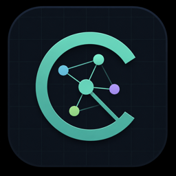
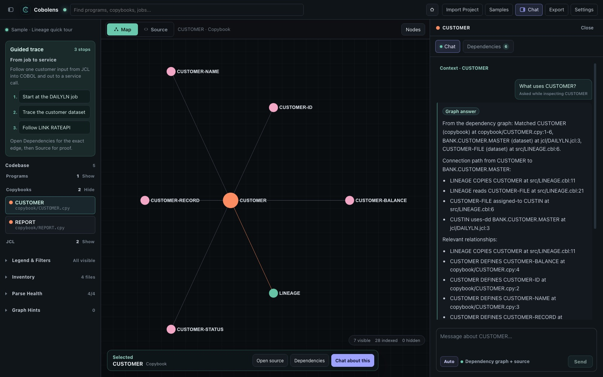
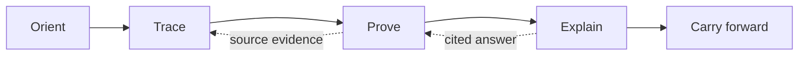
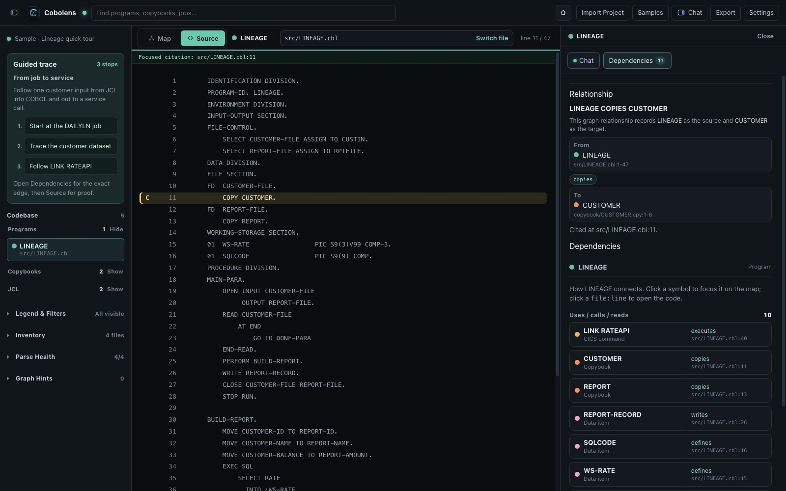
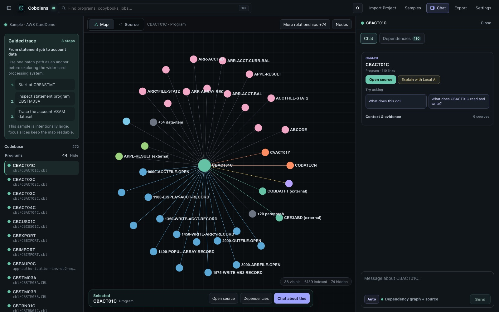
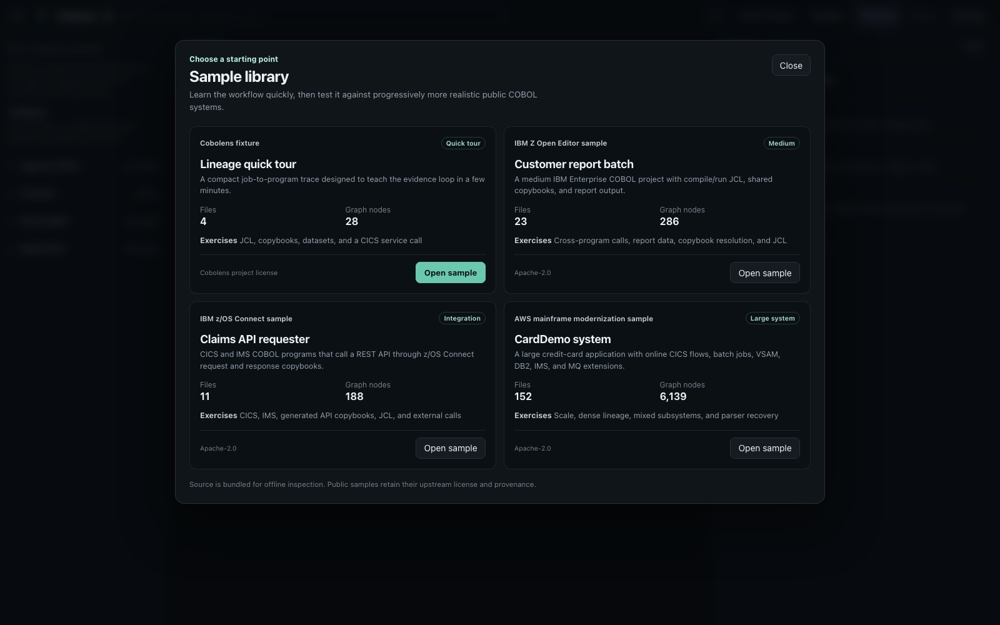

<p align="center">
  
</p>

<h1 align="center">Cobolens</h1>

<p align="center">
  <strong>Trace unfamiliar COBOL systems and prove every answer.</strong><br>
  A free, local-first investigation desk for COBOL, copybooks and JCL. Follow a dependency on the map,
  open the exact source line behind it, and ask questions that stay tied to evidence.
</p>

<p align="center">
  <a href="https://github.com/chrissotraidis/cobolens/actions/workflows/health.yml"></a>
  <a href="https://github.com/chrissotraidis/cobolens/actions/workflows/package.yml"></a>
  
  
  
  
  
  <a href="LICENSE"></a>
  <a href="https://discord.gg/xwHfUD2bxW"></a>
</p>



*The Lineage quick tour sample: the CUSTOMER copybook on the map, and a graph answer in Chat where every claim names its file and line.*

**[Get Cobolens](#get-cobolens) · [How it works](#how-it-works) · [Samples](#sample-library) ·
[Status](#current-status) · [FAQ](#frequently-asked-questions) · [Discord](https://discord.gg/xwHfUD2bxW)**

> [!IMPORTANT]
> **Cobolens helps you understand existing systems.** It does not translate, migrate, generate or modify
> COBOL. Structural answers come from a parsed dependency graph and work offline with no account and no
> model. AI is an optional explanation layer over the evidence you choose to send.
>
> **AI disclosure:** Cobolens is developed with substantial AI assistance. The
> [readiness audit](docs/v1-readiness-audit.md) records what has actually been checked.

## Get Cobolens

| You want to | What to do |
| --- | --- |
| **Try it in two minutes** | Run the [browser preview](#try-the-browser-preview) and open a bundled sample |
| **Open your own codebase** | Run the [desktop app from source](#open-your-own-codebase) on macOS, Windows or Linux |
| **Test a packaged build** | Download an unsigned bundle from the latest [package run](https://github.com/chrissotraidis/cobolens/actions/workflows/package.yml) (GitHub sign-in required) |

**Questions or bugs?** Ask on [Discord](https://discord.gg/xwHfUD2bxW) or
[open an issue](https://github.com/chrissotraidis/cobolens/issues).

### Try the browser preview

You need Node.js 22 or later. The preview uses committed graph and source files, so there is nothing else
to install: no Rust toolchain, COBOL project, account or AI setup.

```sh
git clone https://github.com/chrissotraidis/cobolens.git
cd cobolens
npm install
npm run dev -- --host 127.0.0.1 --port 1420
```

Open <http://127.0.0.1:1420>, choose **Explore samples**, and start with **Lineage quick tour**. Move to
**CardDemo system** when you want to see a 6,139-node project.
Press **⌘K** (or **Ctrl K**) at any time to jump to symbol search.

### Open your own codebase

Importing folders runs through the Tauri desktop app. Install Rust/Cargo from <https://rustup.rs/>, then run:

```sh
cargo build --manifest-path sidecar/cobolens-analyze/Cargo.toml
npm run tauri dev
```

Choose **Import Project** and select the folder that holds your COBOL, copybooks and JCL. Cobolens scans
supported files locally and lists anything it could not fully parse in **Parse Health**, without dropping
the rest of the project.

> [!NOTE]
> The browser preview can also import a folder you pick, but OS keychain storage, desktop caching and
> packaged behavior need the desktop app.

## How it works

Cobolens is built around one loop. Every screen serves a step of it.


```mermaid
flowchart LR
  A["Orient"] --> B["Trace"]
  B --> C["Prove"]
  C --> D["Explain"]
  D --> E["Carry forward"]
  C -. "source evidence" .-> B
  D -. "cited answer" .-> C
```

1. **Orient:** pick a job, program, copybook, dataset, guided stop or search result.
2. **Trace:** follow its direct relationships on a focused map, not a full-graph hairball.
3. **Prove:** open the relationship and the exact source line behind it.
4. **Explain:** ask in Chat with the current selection as context. Answers keep their citations.
5. **Carry forward:** export Markdown, Mermaid and PNG documentation.

| Navigator | Map and Source | Chat and Dependencies |
| --- | --- | --- |
| Codebase tree, guided traces, filters, inventory, parse health and graph hints. | Focus one symbol, expand its neighborhood, and jump straight to cited source. | Ask about the selection, review evidence, follow reverse dependencies and open exact usage sites. |

<p align="center">
  
  
</p>

## Sample library

Four offline scenarios run from a four-file guided trace to a 6,139-node public system. The three public
corpora keep their upstream Apache-2.0 license, pinned revision and provenance.



| Scenario | Scale | Parsed | Graph | Good first question |
| --- | --- | ---: | ---: | --- |
| **Lineage quick tour** · Cobolens fixture | Quick tour | 4/4 files | 28 nodes · 33 edges | What does `DAILYLN` run? |
| **Customer report batch** · [IBM Z Open Editor](https://github.com/IBM/zopeneditor-sample) | Medium | 23/23 files | 286 nodes · 979 edges | What uses `TRANREC`? |
| **Claims API requester** · [IBM z/OS Connect](https://github.com/zosconnect/zosconnect-sample-cobol-apirequester) | Integration | 11/11 files | 188 nodes · 263 edges | How does `CLAIMCI0` reach the API stub? |
| **CardDemo system** · [AWS CardDemo](https://github.com/aws-samples/aws-mainframe-modernization-carddemo) | Large | 152/152 files | 6,139 nodes · 14,008 edges | What reads the account VSAM dataset? |

The [sample library guide](docs/SAMPLE-LIBRARY.md) lists pinned commits, licenses, the 31 visible parser
fallback warnings across the public corpora, and how to regenerate the assets.

## Local AI is optional

The map, source reader, Dependencies, graph answers in Chat, and export need no model. AI explains
retrieved, cited context when you ask it to.

| Route | Where it runs | What leaves your machine |
| --- | --- | --- |
| Graph answers | Inside Cobolens | Nothing |
| Local AI with Ollama | `127.0.0.1:11434` | Nothing |
| Cloud AI with Anthropic, OpenAI or OpenRouter | The provider you choose | Only the retrieved graph and source slice plus your question |

Model answers are citation-guarded: supported cited claims are kept, unsupported claims are removed, and
Cobolens falls back to an explicit graph answer when a response cannot be trusted.

<details>
<summary><strong>Set up local Ollama</strong></summary>

Ollama is the default provider, but Cobolens never assumes it is installed or running. A small model is
the easiest first test:

```sh
ollama pull llama3.2:1b
```

Semantic retrieval is optional and uses a separate embedding model:

```sh
ollama pull nomic-embed-text
```

In Cobolens, open **Settings**, choose **Local AI**, pick a model and run **Check connection**. Semantic
search is prepared only when you ask for it; loading a project never starts an embedding job.

Check the whole local path with:

```sh
npm run ollama:check
npm run ollama:summary-smoke
npm run ollama:ask-smoke
npm run ollama:semantic-smoke
```

</details>

<details>
<summary><strong>Use a cloud provider</strong></summary>

Choose Anthropic, OpenAI or OpenRouter in **Settings**, enter the key, and save it to the OS keychain.
Keys are never written to plaintext settings. The interface shows when cloud mode is active before any
request sends code context.

</details>

## Current status

Cobolens is a **v1 release candidate** covering the planned M0 to M6 scope.

| Area | State |
| --- | --- |
| Map, source sync, search, filters, citations, Dependencies, Chat, export | Implemented |
| Parser | Rust analyzer behind a replaceable `GraphDocument` contract |
| Large projects | Indexed adjacency, paged source, cached reads; checked on CardDemo |
| Desktop | macOS launch and Linux packaging validated; unsigned macOS, Windows and Linux bundles built in CI |
| Not claimed | Signed or notarized installers, full enterprise dialect coverage, behavior equivalence |

The Tauri desktop app is the v1 product.
The browser build is a QA and demo surface: it cannot prove folder access, keychain storage, desktop caching or packaged behavior.
GitHub Actions builds unsigned Linux, Windows, and macOS bundles for QA.
These are unsigned QA/release-candidate bundles.
Unsigned artifacts are not public release installers.
Signed public installers are not claimed until platform signing and notarization are set up and checked.

See the [PRD](docs/COBOL-Lens-PRD.md), [readiness audit](docs/v1-readiness-audit.md) and
[product design contract](docs/PRODUCT-DESIGN.md) for scope and evidence.

## Frequently asked questions

<details>
<summary><strong>Does Cobolens send my code anywhere?</strong></summary>

Not unless you choose a cloud AI provider. Scanning, the map, source reading, graph answers and export run
on your machine. Local AI talks only to Ollama on `127.0.0.1`. A cloud provider receives the
retrieved slice and your question, and the interface labels that mode before anything is sent.

</details>

<details>
<summary><strong>Do I need AI or Ollama?</strong></summary>

No. Questions such as "what uses this copybook?" or "what runs this program?" are answered from the
dependency graph with citations. AI only adds broader explanations on request.

</details>

<details>
<summary><strong>Can it convert COBOL to Java or another language?</strong></summary>

No. Cobolens is an understanding tool. Translation, code generation, behavior-equivalence checks and live
mainframe connections are explicit non-goals for v1.

</details>

<details>
<summary><strong>Which files and dialects does it read?</strong></summary>

By default `.cbl`, `.cob`, `.cpy` and `.jcl` (change this in **Settings**). The analyzer
targets IBM Enterprise COBOL style source plus JCL, and records CICS, DB2, IMS and MQ references.
Anything it cannot fully parse shows up in **Parse Health** with the file and reason, and the rest of the
project still loads. Small reproducible examples of parser gaps are very welcome as issues.

</details>

<details>
<summary><strong>Is there a signed installer?</strong></summary>

Not yet. CI builds unsigned macOS, Windows and Linux bundles for testing only; see the
[release stance](#current-status) above. Signed and notarized installers will be announced once platform
signing has been set up and checked.

</details>

<details>
<summary><strong>Where can I get help?</strong></summary>

Join the [Discord](https://discord.gg/xwHfUD2bxW) or
[open an issue](https://github.com/chrissotraidis/cobolens/issues). Please never post proprietary
source, credentials or production data.

</details>

## Build, package and verify

<details>
<summary><strong>Package the desktop app</strong></summary>

```sh
npm run m6:packaging-readiness
npm run tauri build
```

`npm run tauri build` compiles the frontend and the Rust analyzer sidecar, then packages app resources.
On Linux, install the Tauri prerequisites first:

```sh
sudo apt-get update
sudo apt-get install -y pkg-config libdbus-1-dev libwebkit2gtk-4.1-dev \
  libjavascriptcoregtk-4.1-dev libsoup-3.0-dev libgtk-3-dev \
  libayatana-appindicator3-dev librsvg2-dev patchelf
```

Bundles land in `src-tauri/target/release/bundle/` (`.app` and `.dmg` on macOS; `.deb`, `.rpm` and
`.AppImage` on Linux). They are unsigned release-candidate builds. See
[desktop release hardening](docs/desktop-release-hardening.md) for the signing plan.

</details>

<details>
<summary><strong>Run the checks</strong></summary>

Every push to `main` runs the clean-checkout health workflow. Run the same release-candidate suite
locally before a broad change (it needs Rust on your `PATH`):

```sh
npm run m6:verify
```

It covers the strict parser fixture, frontend build, a driven-browser UI smoke at desktop, tablet and
phone widths, citation, Chat, export, privacy, prompt and guard smokes, Rust formatting and Clippy, and the
sidecar and Tauri tests. Useful focused checks:

```sh
npm run build
npm run ui:smoke
node tools/m6-verify/ui-contract-smoke.mjs
node tools/m6-verify/sample-library-smoke.mjs
npm run v1:readiness
```

Dependency advisories are checked weekly with `npm audit` and `cargo audit` against both Cargo lockfiles.

The strict M6 compatibility assets live at `public/m6-bakeoff-graph.json` and
`public/m6-bakeoff-source.json`. Regenerate them after analyzer changes and before a release with
`npm run m6:fixture-graph`. If a check stops with `Missing required command: cargo`, install Rust/Cargo
from <https://rustup.rs/> and rerun it.

</details>

<details>
<summary><strong>Architecture and repository map</strong></summary>

```text
Tauri shell + React UI + Rust analyzer sidecar + local graph and cache files
```

The key contract is `GraphDocument`: the map, Chat, citations, Dependencies and export all consume the
same graph nodes and edges, and parser internals stay behind the sidecar boundary. ProLeap and mapa remain
benchmarked parser candidates; a JVM analyzer is adopted only if real-code coverage justifies its weight.

| Path | Purpose |
| --- | --- |
| `src/` | React and TypeScript app; design tokens live at the top of `src/App.css` |
| `src/graph/` | Sigma and graphology map |
| `src/model/`, `src/retrieval/` | Providers, prompts, guards, graph answers and semantic retrieval |
| `src-tauri/` | Desktop shell, commands and packaged resources |
| `sidecar/cobolens-analyze/` | Production Rust analyzer |
| `samples/`, `public/samples/` | Pinned public corpora and their generated graph and source assets |
| `tools/` | Verification, packaging, benchmark and local-model scripts |
| `docs/` | PRD, design contract, agent guide, audits and readiness evidence |

Start with the [agent and contributor guide](docs/AGENTS.md), the
[product design thesis](docs/PRODUCT-DESIGN.md) and the [design contract](docs/DESIGN.md). Known debt is
tracked in [docs/tech-debt.md](docs/tech-debt.md).

</details>

## Contributing

Bug reports, parser-gap examples, accessibility findings and focused pull requests are welcome.

1. [Open an issue](https://github.com/chrissotraidis/cobolens/issues) with the smallest COBOL or JCL
   example you are allowed to share.
2. Read the [contributor guide](docs/AGENTS.md) and [product design thesis](docs/PRODUCT-DESIGN.md)
   before changing behavior or layout.
3. Keep the local-first privacy boundary and the `GraphDocument` parser seam intact.
4. Run `npm run m6:verify` before proposing a broad change.

## Roadmap

1. Reduce false-positive relationships and fallback warnings found in the IBM and AWS corpora.
2. Measure packaged-desktop cold load and Map/Source switching on CardDemo-scale data.
3. Make relationship explanations clearer directly on the map.
4. Detect whether Ollama is installed or just stopped, with separate generation and embedding checks.
5. Validate signed macOS and Windows packages before calling any build a public release.

## License

MIT. See [LICENSE](LICENSE). Public sample corpora keep their own Apache-2.0 licenses and provenance.
