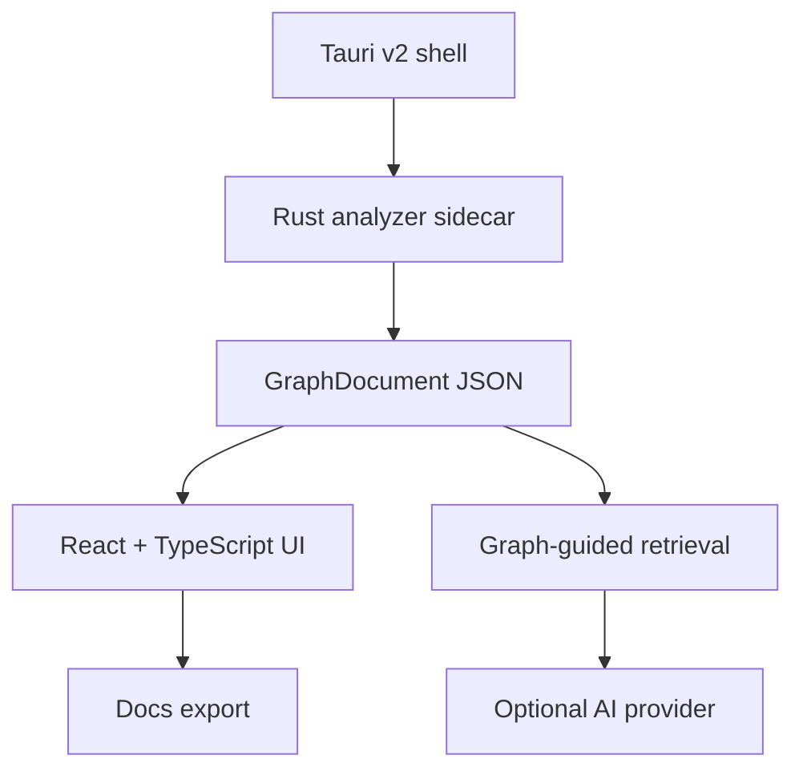

# Cobolens Product Requirements Document

Version: 0.1 local v1 release-candidate spec  
Last updated: 2026-07-01

## One-Line Definition

Cobolens is a free, open-source, local-first desktop app that helps engineers understand COBOL, copybooks, and JCL through an interactive dependency map, cited source inspection, graph-grounded Ask, optional AI summaries, and exportable documentation.

## Product Position

Cobolens is for the individual engineer or small team trying to understand an existing mainframe-adjacent codebase without starting a vendor modernization program.

It is:

- local-first;
- source-cited;
- graph-grounded;
- open source;
- focused on comprehension.

It is not:

- a migration suite;
- a COBOL generator;
- a COBOL-to-Java translator;
- a behavior-equivalence verifier;
- a live mainframe connector;
- a hosted team workspace.

## Primary User

The primary user is a developer who inherits a COBOL/JCL system they did not write and needs to answer practical questions quickly:

- What does this program touch?
- What depends on this copybook?
- Where does this dataset come from?
- What writes this data item?
- Why are these two things connected?
- Can I trust the answer because it points to source?

## Product Principles

1. Lightweight, not over-engineered.
2. Understand, do not migrate.
3. Local-first and private by default.
4. The graph is ground truth.
5. Every important claim should be source-cited.
6. AI is optional and opt-in.
7. Real COBOL is messy; degrade gracefully.
8. Keep the app fast, legible, and maintainable.

## Current V1 Scope

### In Scope

- Open a bundled sample or local folder.
- Discover COBOL programs, copybooks, and JCL.
- Configure scan format, extensions, and encoding.
- Parse into a `GraphDocument` contract.
- Show parse health and non-fatal parse warnings.
- Browse programs, copybooks, and JCL source units.
- Search the codebase.
- Inspect a focus-and-expand dependency graph.
- Filter graph node types.
- Click nodes, relationships, and citations to focus source.
- View source snippets with highlighted cited lines.
- Inspect Overview, Ask, Dependencies, and Source.
- Ask deterministic graph questions without AI.
- Configure local Ollama or cloud providers for optional AI.
- Generate guarded AI summaries with cited graph fallback.
- Export Markdown, Mermaid, and PNG documentation.
- Validate the app with repeatable smoke suites.

### Out Of Scope

- Editing or writing COBOL.
- Automated migration.
- Translation to another language.
- Behavior-equivalence proof.
- Mainframe/z/OS connectivity.
- Team accounts, sync, or hosted backend.
- Paid licensing.

## UX Requirements

### Top Bar

The top bar must stay minimal:

- Brand
- Search codebase
- Current focus
- Local/cloud indicator
- Export
- Settings

### Left Navigator

The left navigator is for navigation and status:

- Ingest actions
- Codebase browser
- Filters and legend
- Inventory
- Parse health
- Graph hints

It must not become a settings console. AI and scan controls live in Settings.

### Center Graph

The graph must avoid the hairball problem.

- Always start from a focus node.
- Show direct relationships and limited expansions.
- Use level-of-detail cluster nodes where needed.
- Provide keyboard-accessible visible node controls.
- Keep graph orientation counts visible.

### Right Pane

The right pane is task-oriented:

- `Overview`: graph facts, evidence, optional AI summary.
- `Ask`: graph Ask first, AI Ask only after setup.
- `Dependencies`: depends-on, used-by, lineage, and relationship details.
- `Source`: file/line focus and source-viewer handoff.

The Source panel remains visible above the inspector where space allows.

## Functional Requirements

| ID | Requirement | V1 Status |
| --- | --- | --- |
| FR-1 | Discover COBOL, copybooks, and JCL from a local folder. | Implemented |
| FR-2 | Support fixed/free COBOL and configurable encoding. | Implemented |
| FR-3 | Cache and rescan without blocking UI. | Implemented |
| FR-4 | List parse failures without failing the whole scan. | Implemented |
| FR-5 | Report dialect/features. | Implemented |
| FR-6 | Emit a graph of programs, paragraphs, copybooks, data items, datasets, JCL, DB2, and CICS signals. | Implemented on current analyzer contract |
| FR-7 | Resolve JCL/program/dataset wiring where possible. | Implemented |
| FR-8 | Record copybook usage. | Implemented |
| FR-9 | Detect SQL/CICS signals where available. | Implemented on fixture and benchmark signals |
| FR-10 | Surface data lineage. | Implemented on current graph signals |
| FR-11 | Surface impact/where-used. | Implemented as Dependencies |
| FR-12 | Flag potentially unreferenced source units. | Partial but useful |
| FR-13 | Provide focus-and-expand graph navigation. | Implemented |
| FR-14 | Avoid full-graph hairballs with LOD/clustering. | Implemented |
| FR-15 | Click nodes/edges/citations to source. | Implemented |
| FR-16 | Provide legend, filters, and orientation. | Implemented |
| FR-17 | Export static diagrams. | Implemented |
| FR-18 | Provide search, breadcrumbs, and Home reset. | Implemented |
| FR-19 | Generate grounded summaries. | Implemented with citation guard and fallback |
| FR-20 | Support Rosetta language setting. | Implemented in prompts |
| FR-21 | Export documentation. | Implemented |
| FR-22 | Provide graph-guided Ask. | Implemented |
| FR-23 | Make citations clickable. | Implemented |
| FR-24 | Link Ask, graph, and source. | Implemented enough for v1 |
| FR-25 | Prevent unsupported model claims. | Implemented by prompts and guards |
| FR-26 | Support Ollama, Anthropic, OpenAI, OpenRouter. | Implemented |
| FR-27 | Store cloud keys in OS keychain. | Implemented in desktop shell |
| FR-28 | Show honest local/cloud mode. | Implemented |
| FR-29 | Show usage and bulk summary estimates. | Implemented |
| FR-30 | Keep embeddings privacy-aware. | Implemented for local Ollama; cloud embeddings rejected |
| FR-31 | Bundle a sample codebase. | Implemented |
| FR-32 | Guide first-run without requiring AI. | Implemented |

## Architecture



The `GraphDocument` JSON contract is the seam. The UI and retrieval layer consume this contract only. Parser internals must remain replaceable.

## Parser Decision

Current v1 production analyzer: Rust sidecar.

Rationale:

- smallest production footprint;
- validated against strict M6 fixture;
- packaged successfully with Tauri;
- enough semantic graph coverage for the current v1 workflow.

Candidate analyzers:

- ProLeap JVM sidecar;
- mapa JVM sidecar.

They remain useful benchmark candidates, but adopting either for production requires real-code evidence that the coverage gain is worth the packaging and maintenance cost.

## Privacy Model

Cobolens has two answer routes:

- Graph route: no model, no external inference.
- AI route: retrieved graph/source context is sent only after the user chooses an AI action and configures a provider.

Local Ollama routes must use localhost. Remote Ollama URLs and cloud embeddings are rejected unless an explicit provider path is implemented and surfaced honestly.

Cloud keys must be stored through the OS keychain, not local app settings.

## Verification Gates

Required before broad product pushes:

```sh
npm run build
node tools/m6-verify/ui-contract-smoke.mjs
npm run m6:verify
```

Readiness sweep:

```sh
npm run v1:readiness
```

Optional evidence:

- local benchmark checkout;
- local Ollama readiness and model smokes;
- Linux packaged GUI smoke;
- parser candidate comparison;
- unsigned CI package artifacts.

## Release Claims

Currently claimed:

- local v1 release candidate;
- Linux packaging validated locally;
- unsigned Linux/Windows bundle builds validated in GitHub Actions;
- graph/Ask/source/export workflow implemented.

Not yet claimed:

- signed public Windows installer;
- signed macOS release;
- real production-corpus parser coverage;
- enterprise readiness;
- behavior-equivalence guarantees.

## Next Research

1. Run on several real COBOL/JCL repos and record parser gaps.
2. Improve source browsing beyond snippets.
3. Tighten relationship explanations directly on graph interactions.
4. Harden local AI setup copy and model checks.
5. Decide whether a JVM analyzer candidate is worth production adoption.
6. Validate signed installer paths.
