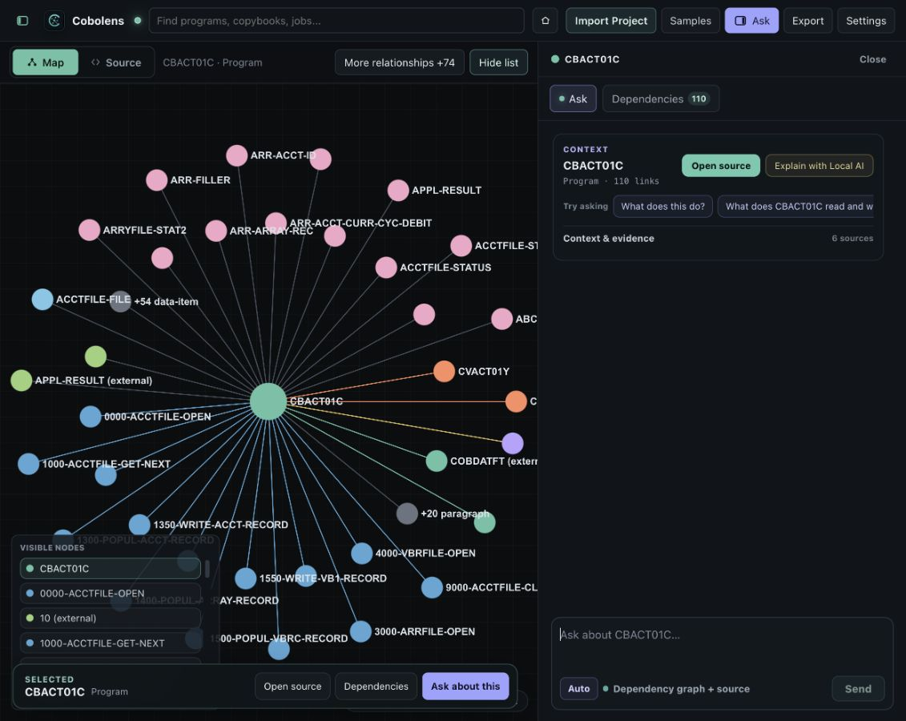
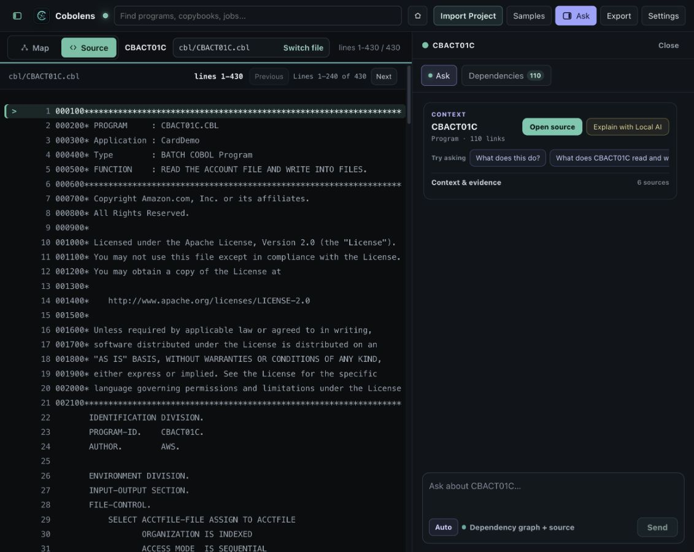
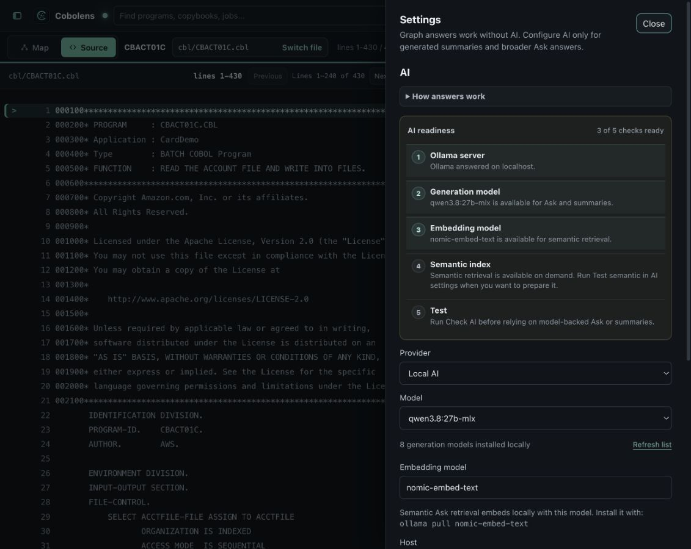
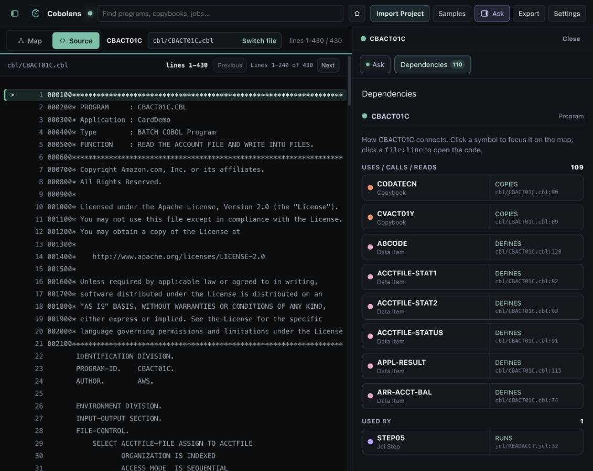

# Human-Scale Product Audit — Loop 6 — 2026-08-31

## Audit scope

Combined UX and accessibility review of the current CardDemo investigation flow at a 1130 × 900 window: Map with visible nodes and Chat, Source with Chat, Dependencies, and Settings.

## User goal and accessibility target

An engineer should be able to select a symbol, understand the current context, move between map/source/dependencies, and start a grounded conversation without clipped labels, colliding overlays, or setup terminology dominating the task. The layout should reflow without hiding meaning, preserve named controls and keyboard paths, and keep secondary detail optional.

## Step 1 — Map, visible nodes, and Chat

**Health: poor.** The graph remains usable and the selected symbol is visible, but three floating surfaces compete over the same lower-left canvas area. The visible-node list is partly covered by the selected bar; the selected bar is artificially narrowed to leave a large unused gap; long node labels are clipped. Chat uses a fixed two-column context layout that truncates the title, metadata, and second suggestion even though substantial vertical space is available.

Accessibility risk: visible text and programmatic accessible names diverge. A keyboard or screen-reader user can reach full names, while a sighted user receives only fragments. The overlapping visible-node list also obscures reachable controls.

## Step 2 — Source with Chat

**Health: mixed.** Source paging, line numbers, and the explicit Map/Source switch are understandable. Chat still clips its selected context and prompts, and its compact overview occupies only the top of a large empty conversation column. The result looks unfinished rather than intentionally quiet.

Accessibility risk: horizontal prompt scrolling has no visible affordance, so keyboard and zoom users may not know more content exists.

## Step 3 — Settings

**Health: poor.** Provider and generation model are the two routine choices, but a five-row readiness diagnostic appears before them. Embedding, semantic index, host, Rosetta, usage, and scanning are all presented at the same level. The drawer is technically complete but asks a human to understand the implementation before making a basic choice.

Accessibility risk: the long, uninterrupted form increases reading and keyboard traversal cost. Status meaning is repeated in the readiness stepper, model metadata, action note, status note, and usage card.

## Step 4 — Dependencies

**Health: good with density risk.** This is the clearest surface: the selected item, directional groups, relationship type, and source location align in a predictable list. It becomes long for high-degree programs, but the hierarchy is consistent and source remains visible beside it.

Accessibility limit: screenshots confirm labels and source locations are visible, but do not prove full keyboard traversal, focus order, or screen-reader announcement quality.

## Strengths

- Map, Source, Dependencies, and conversation remain in one coordinated workspace.
- The selected context is repeated at the right moments.
- Source and relationship evidence stay close to the task.
- The dark palette and semantic node colors are coherent.
- Dependencies demonstrates the compact, task-first density the rest of the app should follow.

## Highest-impact changes

1. Rename the product surface from **Ask** to **Chat** everywhere users see it; questions remain a behavior inside Chat, not the feature name.
2. Make the Chat context a one-column identity block with a separate action row; wrap prompt chips instead of hiding them horizontally.
3. Move visible nodes to the upper-right of the map and reserve the bottom for the selected-symbol bar.
4. Let the selected bar use the available canvas width and wrap at compact widths.
5. Reduce Settings to provider, generation model, and one connection action; move readiness detail, semantic retrieval, host, Rosetta, usage, and scanning into named disclosures.
6. Keep hidden or collapsed content out of layout and paint work.

## Evidence limits

This audit covers the captured browser states and DOM structure. It does not establish full WCAG compliance, screen-reader behavior, packaged Tauri frame time, local-model generation speed, or every OS text-scaling configuration. Those require dedicated assistive-technology and packaged-app tests.

## Implemented result

The accepted states below were replayed at an even narrower 874 × 900 window, where Chat becomes an overlay drawer and the remaining canvas is only 394 pixels wide.

### Map + Chat + visible nodes

**Health: good.** Chat is consistently named, the two suggested questions wrap without horizontal scrolling, the visible-node list stays at the top of the uncovered canvas, and the full selected-symbol action bar stays above the bottom edge without being covered by Chat.

### Source + Chat

**Health: good.** The windowed toolbar reserves the uncovered canvas width, keeps Map/Source explicit, shortens the active file to its basename, and retains the visible `Switch file` action. Chat context, suggestions, and composer keep a consistent width and hierarchy.

### Settings

**Health: good.** Provider, model, and connection are the only routine controls in the initial reading path. Connection diagnostics, retrieval/explanation, usage, and scanning remain available as closed, named disclosures.

## Acceptance checks

- Production build passes.
- Source-contract, accessibility, and model-chat smokes pass.
- Rendered browser smoke passes at desktop, tablet, and phone widths.
- The rendered smoke now rejects visible-node/selection-bar intersections and Chat prompt overflow.
- Missing optional packaged-app and assistive-technology checks remain outside this browser audit.
