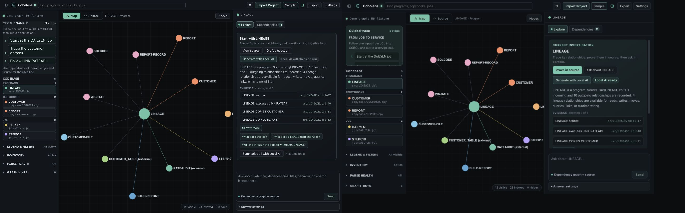
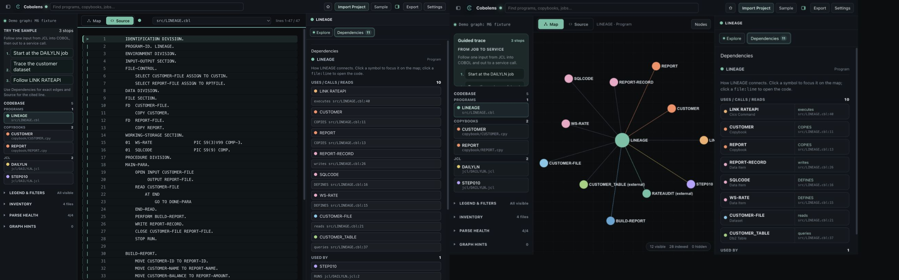

# Product Identity and Journey Audit — 2026-08-30

## Scope

This audit follows a new user through first run, the bundled sample, graph exploration, source, dependencies, model waiting, settings, and a compact viewport. The design target is defined in [PRODUCT-DESIGN.md](../../PRODUCT-DESIGN.md).

## Journey Record

| Step | State | Health | Evidence |
| --- | --- | --- | --- |
| 1 | First run at the default app viewport | Poor | [01-first-run.png](screenshots/01-first-run.png) |
| 2 | First run at a 1440×900 desktop viewport | Poor | [02-desktop-first-run.png](screenshots/02-desktop-first-run.png) |
| 3 | Bundled sample, Explore | Needs work | [03-desktop-sample-explore.png](screenshots/03-desktop-sample-explore.png) |
| 4 | Source reading | Needs work | [04-desktop-source.png](screenshots/04-desktop-source.png) |
| 5 | Dependency inspection | Poor | [05-desktop-dependencies.png](screenshots/05-desktop-dependencies.png) |
| 6 | Local model waiting | Poor | [06-desktop-ai-waiting.png](screenshots/06-desktop-ai-waiting.png) |
| 7 | Settings and readiness | Poor | [07-desktop-settings.png](screenshots/07-desktop-settings.png) |
| 8 | Sample at 430×820 | Poor | [08-phone-sample.png](screenshots/08-phone-sample.png) |

## What Is Working

- The underlying three-part model is strong: navigate, inspect a graph or source, then explain.
- The dependency map is the most distinctive and legible product surface.
- Direct source jumps, cited evidence, privacy labels, and graph-only answers create real trust.
- The dark neutral palette and restrained teal accent are appropriate foundations.

## Main Findings

### 1. The product promise is absent

First run repeats setup mechanics in the navigator and canvas while leaving the inspector empty. It does not say what useful outcome the user will reach. The app initially reads as a parser viewer, not an investigation workflow.

### 2. Typography is uniformly compressed

Body copy, paths, buttons, relationship labels, settings instructions, and AI status text are commonly presented at approximately 10–12px. Uppercase labels and monospace paths are overused. The result is technically dense without being information-dense.

### 3. Too many elements have equal weight

Most actions and information blocks receive a border. Explore mixes source navigation, answer generation, graph facts, evidence, suggested prompts, and bulk tools in one introductory surface. The next action is unclear.

### 4. Conversation is attached, not integrated

The composer is large and remote from evidence. During inference, a context banner, status card, five-step pipeline, and composer compete while most of the pane is empty. The staged pipeline can disagree with the actual model state.

### 5. Dependencies duplicate information

Relationship targets and source sites are rendered as separate stacked controls, then several relationships are repeated in a second data-flow section. The most evidence-rich view is also the hardest to scan.

### 6. Settings exposes readiness machinery

Five readiness cards remain visible even when healthy, followed by a dense form and several similar test actions. Setup feels like maintaining infrastructure instead of selecting an optional explanation provider.

### 7. Compact layout shrinks before it prioritizes

At 430px, top-bar controls crowd and clip, graph labels reach the edges, and desktop panes become a long vertical page. The interface needs explicit compact modes rather than smaller desktop controls.

## Accessibility Risks

- Several text styles appear below a comfortable reading size.
- Muted gray copy has low visual prominence on dark surfaces.
- A number of compact controls appear smaller than a comfortable touch target.
- Color is usually paired with text, but focus, keyboard order, contrast ratios, and screen-reader announcements still require dedicated verification.

## Goal-Based Repair Loop

1. Define the product thesis, personality, core loop, and interface grammar in the repository.
2. Establish a readable type scale, calmer surfaces, clear action hierarchy, and consistent state colors.
3. Replace repeated first-run guidance with one promise-led welcome and two clear paths.
4. Make Explore an evidence-led conversation: brief, proof, prompt, answer.
5. Compress Dependencies into scannable relationship rows with source sites secondary.
6. Replace model pipeline theater with one truthful, useful progress state.
7. Collapse healthy readiness details and simplify model setup actions.
8. Make compact layouts prioritize panes and touch targets rather than stack the whole desktop.
9. Replay the same journey, capture every state, compare before and after, and run behavior/accessibility contracts.

## Implemented Result

The loop produced a coherent evidence-desk interface rather than a cosmetic reskin:

- first run now leads with the product promise and one sample action;
- the inspector explains the Trace → Prove → Explain loop instead of remaining blank;
- body copy, controls, codebase rows, evidence, forms, and relationship labels use a readable hierarchy;
- the sample tour is a compact guided trace;
- Explore leads with the current investigation, gives source proof the primary action, previews three evidence rows, and keeps project-wide tools collapsed;
- model work uses one truthful progress card instead of a speculative five-step pipeline;
- completed answers preserve their reading position and do not jump to the composer;
- Dependencies removes its duplicate data-flow section and combines each target, type, relationship, and source site into one scannable row;
- Settings collapses the readiness machinery when all checks pass and makes one readiness check the primary action;
- compact loading returns to the map, uses two top-bar rows, preserves touch-sized actions, and reduces graph label density.

## Before and After

The combined captures below place the original state on the left and the implemented state on the right at the same 1440×900 design viewport.

Additional accepted states:

- [First run](screenshots/15-after-desktop-first-run.png)
- [Explore](screenshots/11-after-desktop-sample-overview-fixed.png)
- [Dependencies](screenshots/12-after-desktop-dependencies.png)
- [Source beside dependency evidence](screenshots/13-after-desktop-source.png)
- [Settings](screenshots/14-after-desktop-settings.png)
- [Compact map](screenshots/19-after-phone-sample-graph-fixed.png)
- [Compact model wait](screenshots/20-after-phone-ai-waiting.png)

## Interactive Verification

- The bundled sample opens and resets the compact journey to the map.
- Map, Source, Explore, Dependencies, evidence jumps, and Settings remain interactive.
- `qwen3.8:27b-mlx` completed an open-ended explanation with three claims and clickable source citations. First text took roughly 30 seconds in this run.
- The static UI contract, accessibility contract, layout-state, inspector-progress, and chat-history smokes pass.
- The production TypeScript/Vite build passes.

The complete release suite includes a separate browser launcher. This audit used the user's open in-app browser for rendered verification, so that duplicate browser run was intentionally not launched.
