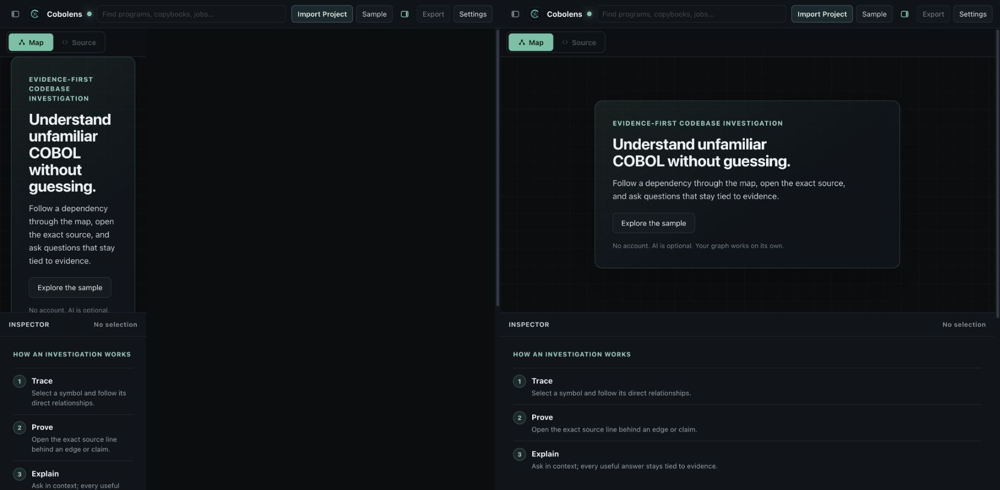

# Responsive Shell Regression — 2026-08-30

## Scope

Reproduce and repair the broken first-run layout shown at the user's current in-app browser viewport, then verify the same viewport with the sample, Source, and Settings.

## Cause

The later product-identity stylesheet re-declared the desktop three-column `.shell` after the original `max-width: 1024px` rules. At widths under 1025px, that later desktop declaration won the cascade, leaving the stacked workspace constrained to the 268px navigator column while the rest of the viewport stayed empty.

Source navigation also moved keyboard focus into the source reader without protecting the stacked shell's scroll position, which could hide the Map/Source toolbar.

## Steps

| Step | State | Health | Evidence |
| --- | --- | --- | --- |
| 1 | Current first-run viewport before repair | Broken | [01-broken-current-viewport.png](screenshots/01-broken-current-viewport.png) |
| 2 | First run after restoring one full-width column | Healthy | [02-fixed-current-viewport.png](screenshots/02-fixed-current-viewport.png) |
| 3 | Bundled sample at the same viewport | Healthy | [03-fixed-sample-current-viewport.png](screenshots/03-fixed-sample-current-viewport.png) |
| 4 | Source navigation at the same viewport | Healthy | [06-fixed-source-navigation-current-viewport.png](screenshots/06-fixed-source-navigation-current-viewport.png) |
| 5 | Settings at the same viewport | Healthy | [07-fixed-settings-current-viewport.png](screenshots/07-fixed-settings-current-viewport.png) |

## Before and After

The original broken capture is on the left; the repaired capture at the same viewport and state is on the right.

## Repair

- Reassert the full-width, one-column shell inside the final tablet breakpoint so later desktop declarations cannot override it.
- Remove the inspector row completely when the inspector is collapsed at a stacked breakpoint.
- Route Map/Source changes through one helper that returns the stacked shell to the canvas top.
- Keep keyboard focus on the source reader without allowing focus to scroll the toolbar away.
- Add contract coverage against this exact cascade and navigation regression.

## Evidence Limits

The visual captures confirm responsive reflow, hierarchy, and visible control placement at the reported viewport. Keyboard and assistive-technology behavior still rely on the existing semantic/accessibility checks rather than screenshots alone.
